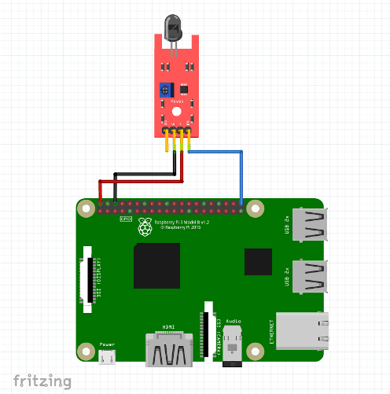
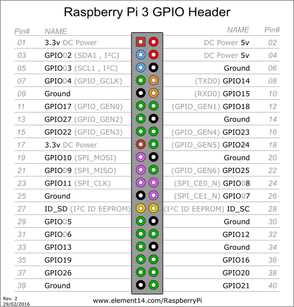

# Workshop flame sensor

# Introduction
In this workshop we will see how to detect heat/fire/flame with the flame sensor using the Raspberry Pi. 

# Wiring



|flame sensor         |  Raspberry Pi  |
|---------------------|----------------|
| Ground 		      | GND            |
| Vcc / + 		      | 5V             |
| DO (digital output) | GPIO 21        |



# Code

## 1- Power your raspberry

You can achive it with connecting it to your pc trought the Micro USB Port of the raspberry pi


## 2- Connect to your raspberry pi
Using putty if you're on windows, Ssh if you're on a linux based os
Follow the following instruction if you dont know how to connect to raspberry pi
[Connect to Raspberry Pi using Putty](https://github.com/ionoid-io-projects/workshop/blob/master/doc/od-iot-raspbian-rpi-zero-windows.md#5-first-boot)

## 3- Download Flame Sensor binary file

Assuming you're connected with... copy and past this command
If you're using Raspberry zero
```
curl -O https://raw.githubusercontent.com/ionoid-io-projects/workshop_flame_sensor/master/bin/arm6/flame
```

If you're using Raspberry 3 b
```
curl -O https://raw.githubusercontent.com/ionoid-io-projects/workshop_flame_sensor/master/bin/arm7/flame
```
## make it executable
```
chmod +x flame
```

## 4- execute binary
```
./flame
```

## How to stop the program
To quit or stop the program click on **Ctrl+C**


Congratulation.

Ressource
Follow link below for pin connections 
https://www.piddlerintheroot.com/flame-sensor/